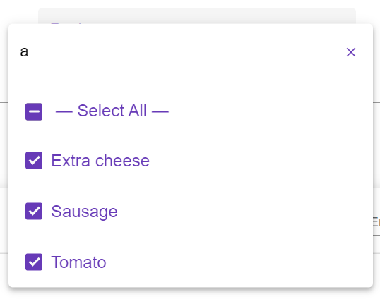

# Angular Material - Select Search

[StackBlitz](https://stackblitz.com/edit/angular-material-select-filter-search)

Angular Material select component modified to include a search to be used standalone or as a filter for another component.

# Examples

## Single Select

    
    
    

## Multi Select

    
    
    

# Features

- Search functionality embedded in the select component
- Clear search button
- 'None' option for when acting as a filter for an optional attribute
- Single mode:
    - reset selection
- Multi mode
    - select all &rarr; select only options currently shown (includes intermediary state)
